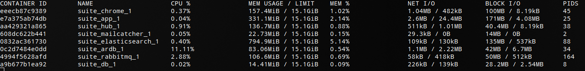

Latest spryker suite (official release 202009) announced on 09.09.2020 11:00 am provided in a minimal fast setup.
 - No complexity in setup
 - Fast and stable
 - Native usage in development
 
Installation Notes [install docs](docker/README.md)

#### Services (for service versions check [install docs](docker/docker-compose.yml)
###### PHP
http://de.www.suite.local   bill.martin@spryker.com/change123

http://de.zed.suite.local   admin@spryker.com/change123

http://de.glue.suite.local   bill.martin@spryker.com/change123

###### Jenkins
http://localhost:9090

###### RabbitMQ
http://localhost:15672
spryker/mate20mg

###### Postgres
jdbc:postgresql://localhost:5432/postgres
spryker/mate20mg

